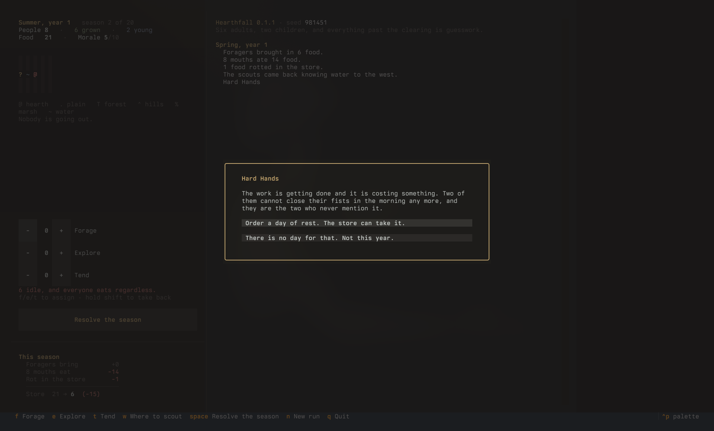

<p align="center">
  
</p>

# Hearthfall

A grimdark clan-survival game for the terminal. Start with a handful of villagers and a
fog-black map. Send people out; the world reveals itself tile by tile through scarcity,
story, and violence. Grow a hearth into a war-band into a people, or bury them.

Think *A Dark Room* that grows a spine into *King of Dragon Pass*, rendered in glyphs.

<p align="center">
  
</p>

> **Status: v0.5.1. Sub-project 2 of eight, in progress.** Playable start to finish, and
> deliberately small: one map, three jobs, twenty seasons. There is no combat yet and no
> enemy, so the later tiers of the spine below are designed but not built. See
> [`roadmap.md`](roadmap.md) for what each slice has to prove before the next one starts,
> and for the standing rule that no slice ships until a year of it has been *played*.

## The spine

**Read the unknown at cost. Then commit resources you cannot take back.**

That is the whole game, at every scale it reaches. Early it is *this tile is forest*, paid for
with hands you needed elsewhere, committed as a season of foraging you cannot undo. Later it is
*Stonefold fields forty spears and no bows*, and the commitment is a war-stack.

The mechanical form is that **fog is a property of a fact, not of a tile.** Everything knowable
has a value, an age, and a price to look again. Terrain never goes stale. A neighbour's grain
store goes stale in a season, and their intent goes stale faster. You are always acting on a
picture that is partly out of date, and the game is choosing which part you can afford to be
wrong about.

It already pays. Measured over 200 seeds, a clan that never scouts ends with 1.4 people; one
that scouts ends with 6.5; one that also reads the seasons ends with 7.8.

## The turn

Time is seasonal, four turns to a year, and winter never negotiates. The tension is always
the same shape: not enough hands, not enough food, and the dark is full of things you have
not scouted yet. Each season you split a finite clan three ways:

- **Forage** brings in food, scaled by the season *and by the ground you have walked*. Each
  known tile supports only so many foragers; hands beyond that come back with nothing. Winter
  yields nothing anywhere, because there is nothing out there to find.
- **Scout** costs you the hands that went, and how many went decides what they bring home.
  Two can cover ground: they walk into the dark and learn what is out there, and the clan can
  work it thinly. A third means the party can stop and survey somewhere, which is what lifts a
  tile to the whole crew its terrain will carry. Scouting is the only thing that raises the
  ceiling on how much labour can be spent on food at all. The party comes home with an
  account of where it went, what is there, and whether it was worth the walk. **Ground the
  clan leans on thins out and ground it rests comes back, and a survey only records what was
  true the season it was made**, so a clan that stops looking is soon planning its seasons
  around a wood that is not what it remembers.
- **Tend** slows the rot in the store, and can never quite stop it.

Then the season resolves, the world asks you something with no clean answer, and you live
with it. Children eat and cannot work. Everyone eats regardless.

**When the store cannot cover the winter, you decide who goes short.** Equal shares, the
workers first, or the children first. There is no right answer: an even split is measurably
*worse* for survival, because spreading a shortfall pushes every hearth into the starvation
threshold at once. What it buys is that nobody was wronged. The clan is kin groups, not a
number, and the hearth you feed last remembers being fed last.

## The clan remembers

Events are TOML, and they have a memory. A choice can write to a counter that persists for the
whole run, and a later event can require not merely that something happened but that you
answered it a particular way.

Overrule the elder in your first year and it runs, over years, toward a man who stops arguing
and starts arranging. Defer to him, at a cost you pay that evening, and it runs somewhere else.
Nothing announces this and no meter is shown. The powerful moments are rare because they are
hard to reach, never because a die came up short.

Eighty-two entries so far, keyed on the season, the ground, the hearths, how much the clan
knows and how long since it checked. A clan that fed strangers in a year it could not afford to
is remembered by somebody three days' walk away; a clan that has buried enough people answers
questions differently.

## Architecture

The engine is a pure Python library with no I/O, no rendering, and no dependencies. The TUI
is a thin, shed-able skin over it.

```
src/hearthfall/engine/   pure logic, stdlib only, fully tested
src/hearthfall/tui/      Textual skin; the engine does not know it exists
src/hearthfall/data/     TOML content: events, tallies, terrain
tests/                   the engine is tested; the skin is not
```

You can drive a full game from a Python REPL with zero terminal. Every random draw goes
through one seeded, injectable RNG, so a seed reproduces a run exactly. Both properties are
enforced by tests, not by good intentions, and so is the engine's freedom from dependencies.

The language choice was re-opened against Rust in August 2026 and confirmed; `spec.md` §8 has
the reasoning and the measurements. What a stricter type system would have bought is bought
directly instead: pyright runs in strict mode over the engine and gates CI at zero errors.

## Playing

```sh
uv venv && uv pip install -e .
.venv/bin/hearthfall
.venv/bin/hearthfall --seed 42   # replay a run exactly
```

`f` `e` `t` assign a job, shift takes one back, `w` cycles where the scouts go, `r` chooses
how to ration a short store, space resolves the season.

## Requirements

- Python 3.14+
- Textual (frontend only; the engine needs nothing)

## Running the tests

```sh
./run_tests.sh
```

## Documentation

- [`spec.md`](spec.md): the contract. Read it before changing semantics.
- [`roadmap.md`](roadmap.md): the eight sub-projects, their kill gates, and what playing
  each one actually revealed.
- [`patchnotes.md`](patchnotes.md): release notes.

## License

MIT. See [`LICENSE`](LICENSE).
